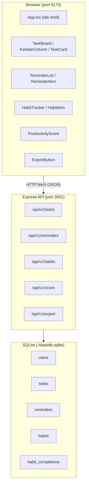
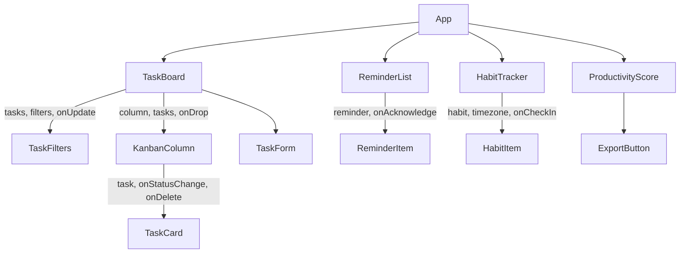

# DailyFlow – Technical Design Document

## Overview

DailyFlow is a single-user personal productivity hub running entirely on localhost. It is built as a **pnpm/npm monorepo** with two packages:

- **`packages/api`** — Express 4 / TypeScript REST API on port 3001 backed by a local SQLite database (`./data/db.sqlite` via `better-sqlite3`).
- **`packages/web`** — React 18 / Vite / TypeScript SPA on port 5173.

The three data modules — **Tasks**, **Reminders**, and **Habits** — each expose their own API router and React feature slice. A read-only **Productivity Score** endpoint aggregates all three. A **Data Export** endpoint serialises the full dataset to a timestamped JSON file in `./exports/`.

No authentication, no multi-user support, and no external services are required.

---

## Architecture

### System Diagram



### Communication Contract

- Every API response uses the `ApiResponse<T>` envelope: `{ data: T | null, error: string | null }`.
- List endpoints wrap data in `PaginatedResponse<T>` (inside `ApiResponse.data`): `{ items: T[], meta: { page, pageSize, total } }`.
- The frontend never stores raw data — it always reads from `response.data` and checks `response.error`.
- CORS is already configured in `app.ts` to allow `http://localhost:5173`.

---

## Components and Interfaces

### Backend Module Layout

Each module lives in `packages/api/src/modules/<name>/` and exports a single Express `Router`.

```
packages/api/src/
├── app.ts                        (existing — uncomment module routers)
├── db.ts                         (existing — extend initDb() with new tables)
├── index.ts                      (existing — unchanged)
├── types/
│   └── shared.ts                 (existing — ApiResponse, PaginatedResponse, User)
└── modules/
    ├── tasks/
    │   ├── router.ts             (new — CRUD for tasks)
    │   ├── service.ts            (new — business logic, DB queries)
    │   └── types.ts              (new — Task, CreateTaskDto, PatchTaskDto)
    ├── reminders/
    │   ├── router.ts             (new — CRUD + acknowledge)
    │   ├── service.ts            (new — business logic, DB queries)
    │   └── types.ts              (new — Reminder, CreateReminderDto)
    ├── habits/
    │   ├── router.ts             (new — CRUD + check-in)
    │   ├── service.ts            (new — business logic, DB queries)
    │   ├── streakUtils.ts        (existing — fix timezone bug, see §Streak Calculation)
    │   └── types.ts              (new — Habit, HabitCompletion, CreateHabitDto)
    ├── score/
    │   ├── router.ts             (new — GET /score)
    │   └── service.ts            (new — formula computation)
    └── export/
        └── router.ts             (existing stub — replace with real fs implementation)
```

### Frontend Feature Layout

```
packages/web/src/
├── App.tsx                        (existing — unchanged tab shell)
└── features/
    ├── tasks/
    │   ├── components/
    │   │   ├── TaskBoard.tsx      (existing — refactored to state-only, ~80 lines)
    │   │   ├── KanbanColumn.tsx   (new — column container + drop zone)
    │   │   ├── TaskCard.tsx       (new — single card with drag + actions)
    │   │   ├── TaskFilters.tsx    (new — category + priority selects)
    │   │   └── TaskForm.tsx       (new — create task inline form)
    │   ├── hooks/
    │   │   └── useTasks.ts        (new — fetch, create, update, delete with optimistic updates)
    │   └── types.ts               (new — Task, Status, Priority, Category)
    ├── reminders/
    │   ├── components/
    │   │   ├── ReminderList.tsx   (new — sorted list container)
    │   │   └── ReminderItem.tsx   (new — item with overdue indicator + ack button)
    │   ├── hooks/
    │   │   └── useReminders.ts    (new — fetch, create, acknowledge with optimistic updates)
    │   └── types.ts               (new — Reminder)
    ├── habits/
    │   ├── components/
    │   │   ├── HabitTracker.tsx   (new — list container)
    │   │   └── HabitItem.tsx      (new — name, streak, check-in button)
    │   ├── hooks/
    │   │   └── useHabits.ts       (new — fetch, create, check-in with optimistic updates)
    │   └── types.ts               (new — Habit)
    └── score/
        ├── components/
        │   └── ProductivityScore.tsx (new — score value + progress bar + component rates)
        │   └── ExportButton.tsx   (new — trigger export, display file path banner)
        └── hooks/
            └── useScore.ts        (new — fetch score)
```

### Frontend Component Hierarchy and Props



**TaskBoard** (`state: Task[], filterCategory, filterPriority, draggedId`)
- Owns all task state and the `useTasks` hook.
- Renders `TaskFilters`, three `KanbanColumn`s, and `TaskForm`.
- Handles optimistic drag-drop with rollback.

**KanbanColumn** (`props: status, label, tasks, draggedId, onDrop, onStatusChange, onDelete`)
- Drop zone for a single Kanban column.
- Renders a list of `TaskCard`.

**TaskCard** (`props: task, onStatusChange, onDelete, onDragStart`)
- Draggable. Shows priority dot, title, description, category tag, due date.
- Back / Forward / Delete action buttons.

**TaskFilters** (`props: filterCategory, filterPriority, onCategoryChange, onPriorityChange`)
- Two controlled `<select>` elements.

**TaskForm** (`props: onAdd, onCancel`)
- Controlled form. Emits `CreateTaskDto` on submit. Blocks empty title.

**ReminderList** (`state: Reminder[]` via `useReminders`)
- Sorted by `dueAt` ascending. Renders `ReminderItem` per entry.

**ReminderItem** (`props: reminder, onAcknowledge`)
- Displays title, formatted due time, overdue indicator when `dueAt < now && !acknowledged`.
- "Acknowledge" button; disabled when already acknowledged.

**HabitTracker** (`state: Habit[]` via `useHabits`, `timezone: string`)
- Timezone detected once via `Intl.DateTimeFormat().resolvedOptions().timeZone`.
- Renders `HabitItem` per active habit.

**HabitItem** (`props: habit, onCheckIn`)
- Shows name, current streak count, "Check In" button (disabled if already checked in today).

**ProductivityScore** (`state: ScoreData` via `useScore`)
- Numeric score, `<progress>` bar, three component rate values.
- Renders `ExportButton`.

**ExportButton** (`props: none / internal state for banner`)
- Calls `POST /api/v1/export`; shows success banner with file path until dismissed.

---

## Data Models

### TypeScript Types (shared between API modules)

```typescript
// packages/api/src/modules/tasks/types.ts
export type TaskStatus   = 'todo' | 'in_progress' | 'done';
export type TaskPriority = 'low' | 'medium' | 'high';
export type TaskCategory = 'work' | 'personal' | 'health';

export interface Task {
  id: string;
  title: string;
  description: string;
  status: TaskStatus;
  priority: TaskPriority;
  category: TaskCategory;
  dueDate: string | null;   // YYYY-MM-DD or null
  createdAt: string;         // ISO 8601
}

export interface CreateTaskDto {
  title: string;
  description?: string;
  priority: TaskPriority;
  category: TaskCategory;
  dueDate?: string | null;
}

export interface PatchTaskDto {
  title?: string;
  description?: string;
  status?: TaskStatus;
  priority?: TaskPriority;
  category?: TaskCategory;
  dueDate?: string | null;
}
```

```typescript
// packages/api/src/modules/reminders/types.ts
export interface Reminder {
  id: string;
  title: string;
  dueAt: string;        // ISO 8601 date-time
  acknowledged: boolean;
  createdAt: string;    // ISO 8601
}

export interface CreateReminderDto {
  title: string;
  dueAt: string;
}

export interface PatchReminderDto {
  title?: string;
  dueAt?: string;
}
```

```typescript
// packages/api/src/modules/habits/types.ts
export type HabitFrequency = 'daily';

export interface Habit {
  id: string;
  name: string;
  description: string;
  frequency: HabitFrequency;
  active: boolean;
  createdAt: string;    // ISO 8601
  streak?: number;      // populated by GET /habits
}

export interface HabitCompletion {
  id: string;
  habitId: string;
  completedDate: string; // YYYY-MM-DD in the requested timezone
  createdAt: string;     // ISO 8601
}

export interface CreateHabitDto {
  name: string;
  description?: string;
  frequency?: HabitFrequency;
}
```

```typescript
// packages/api/src/modules/score/service.ts (return type)
export interface ScoreData {
  score: number;                  // 0–100, rounded to 2dp
  taskCompletionRate: number;     // 0–1
  reminderAckRate: number;        // 0–1
  habitStreakConsistency: number; // 0–1
}
```

### SQLite Schema

The following DDL extends the existing `initDb()` in `packages/api/src/db.ts`. The `users` table and pragma calls already exist — only the four new `CREATE TABLE IF NOT EXISTS` blocks need to be added inside the `db.exec(...)` call.

```sql
-- ── Tasks ──────────────────────────────────────────────────────────────────
CREATE TABLE IF NOT EXISTS tasks (
  id          TEXT    PRIMARY KEY,
  title       TEXT    NOT NULL CHECK(length(title) >= 1 AND length(title) <= 200),
  description TEXT    NOT NULL DEFAULT '' CHECK(length(description) <= 1000),
  status      TEXT    NOT NULL DEFAULT 'todo'
                      CHECK(status IN ('todo','in_progress','done')),
  priority    TEXT    NOT NULL CHECK(priority IN ('low','medium','high')),
  category    TEXT    NOT NULL CHECK(category IN ('work','personal','health')),
  due_date    TEXT,   -- YYYY-MM-DD or NULL
  created_at  TEXT    NOT NULL DEFAULT (datetime('now'))
);

CREATE INDEX IF NOT EXISTS idx_tasks_status   ON tasks(status);
CREATE INDEX IF NOT EXISTS idx_tasks_category ON tasks(category);
CREATE INDEX IF NOT EXISTS idx_tasks_priority ON tasks(priority);

-- ── Reminders ──────────────────────────────────────────────────────────────
CREATE TABLE IF NOT EXISTS reminders (
  id           TEXT    PRIMARY KEY,
  title        TEXT    NOT NULL CHECK(length(title) >= 1 AND length(title) <= 200),
  due_at       TEXT    NOT NULL,  -- ISO 8601 date-time
  acknowledged INTEGER NOT NULL DEFAULT 0 CHECK(acknowledged IN (0,1)),
  created_at   TEXT    NOT NULL DEFAULT (datetime('now'))
);

CREATE INDEX IF NOT EXISTS idx_reminders_due_at       ON reminders(due_at);
CREATE INDEX IF NOT EXISTS idx_reminders_acknowledged ON reminders(acknowledged);

-- ── Habits ─────────────────────────────────────────────────────────────────
CREATE TABLE IF NOT EXISTS habits (
  id          TEXT    PRIMARY KEY,
  name        TEXT    NOT NULL CHECK(length(name) >= 1 AND length(name) <= 200),
  description TEXT    NOT NULL DEFAULT '' CHECK(length(description) <= 500),
  frequency   TEXT    NOT NULL DEFAULT 'daily' CHECK(frequency IN ('daily')),
  active      INTEGER NOT NULL DEFAULT 1 CHECK(active IN (0,1)),
  created_at  TEXT    NOT NULL DEFAULT (datetime('now'))
);

CREATE INDEX IF NOT EXISTS idx_habits_active ON habits(active);

-- ── Habit Completions ──────────────────────────────────────────────────────
CREATE TABLE IF NOT EXISTS habit_completions (
  id             TEXT PRIMARY KEY,
  habit_id       TEXT NOT NULL REFERENCES habits(id) ON DELETE CASCADE,
  completed_date TEXT NOT NULL,  -- YYYY-MM-DD in the caller's timezone
  created_at     TEXT NOT NULL DEFAULT (datetime('now')),
  UNIQUE(habit_id, completed_date)
);

CREATE INDEX IF NOT EXISTS idx_habit_completions_habit_id ON habit_completions(habit_id);
```

**Key design decisions:**
- `acknowledged` stored as `INTEGER 0/1` (SQLite has no native BOOLEAN).
- `active` on habits uses soft-delete: `DELETE /api/v1/habits/:id` sets `active = 0` rather than removing the row, preserving `habit_completions` history for score calculations.
- `UNIQUE(habit_id, completed_date)` enforces the one-check-in-per-day rule at the database level, complementing the API-level 409 guard.
- `completed_date` stores the calendar date string in the caller's timezone (e.g., `2024-06-15`), not a UTC timestamp — this is what makes timezone-correct streak calculation possible.
- Foreign key cascade: deleting a habit row (hard delete, not used by this API) would also remove its completions. Soft-delete via `active=0` avoids triggering this.

---

## API Route Table

All routes are prefixed `/api/v1`. Responses always use `ApiResponse<T>`.

### Tasks — `/api/v1/tasks`

| Method | Path | Description | Request Body | Success Response |
|--------|------|-------------|-------------|-----------------|
| `GET` | `/tasks` | List all tasks (paginated) | `?page&pageSize&status&category&priority` | `ApiResponse<PaginatedResponse<Task>>` |
| `POST` | `/tasks` | Create a task | `CreateTaskDto` | `ApiResponse<Task>` HTTP 201 |
| `GET` | `/tasks/:id` | Get single task | — | `ApiResponse<Task>` |
| `PATCH` | `/tasks/:id` | Update task fields | `PatchTaskDto` | `ApiResponse<Task>` |
| `DELETE` | `/tasks/:id` | Delete a task | — | `ApiResponse<null>` HTTP 204 |

### Reminders — `/api/v1/reminders`

| Method | Path | Description | Request Body | Success Response |
|--------|------|-------------|-------------|-----------------|
| `GET` | `/reminders` | List all reminders (paginated) | `?page&pageSize` | `ApiResponse<PaginatedResponse<Reminder>>` |
| `POST` | `/reminders` | Create a reminder | `CreateReminderDto` | `ApiResponse<Reminder>` HTTP 201 |
| `GET` | `/reminders/:id` | Get single reminder | — | `ApiResponse<Reminder>` |
| `PATCH` | `/reminders/:id` | Update reminder fields | `PatchReminderDto` | `ApiResponse<Reminder>` |
| `DELETE` | `/reminders/:id` | Delete a reminder | — | `ApiResponse<null>` HTTP 204 |
| `POST` | `/reminders/:id/acknowledge` | Acknowledge a reminder | — | `ApiResponse<Reminder>` |

### Habits — `/api/v1/habits`

| Method | Path | Description | Request Body / Query | Success Response |
|--------|------|-------------|---------------------|-----------------|
| `GET` | `/habits` | List active habits with streaks | `?timezone=<IANA>&page&pageSize` | `ApiResponse<PaginatedResponse<Habit>>` |
| `POST` | `/habits` | Create a habit | `CreateHabitDto` | `ApiResponse<Habit>` HTTP 201 |
| `GET` | `/habits/:id` | Get single habit | `?timezone=<IANA>` | `ApiResponse<Habit>` |
| `PATCH` | `/habits/:id` | Update habit fields | `{ name?, description? }` | `ApiResponse<Habit>` |
| `DELETE` | `/habits/:id` | Soft-delete (sets active=false) | — | `ApiResponse<null>` HTTP 204 |
| `POST` | `/habits/:id/check-in` | Record today's check-in | `?timezone=<IANA>` | `ApiResponse<HabitCompletion>` HTTP 201 |

### Productivity Score — `/api/v1/score`

| Method | Path | Description | Request Body / Query | Success Response |
|--------|------|-------------|---------------------|-----------------|
| `GET` | `/score` | Compute and return score | `?timezone=<IANA>` (for HSC) | `ApiResponse<ScoreData>` |

### Export — `/api/v1/export`

| Method | Path | Description | Request Body | Success Response |
|--------|------|-------------|-------------|-----------------|
| `POST` | `/export` | Write full dataset to JSON file | — | `ApiResponse<{ filePath: string }>` |

### Error Response Codes

| Code | When |
|------|------|
| `400` | Validation failure (missing/invalid field, bad pagination params) |
| `404` | Referenced `id` not found |
| `409` | Duplicate check-in; check-in on inactive habit |
| `500` | Filesystem error during export |

---

## Streak Calculation

### Problem with Existing Code

`streakUtils.ts` uses `d.toISOString().split('T')[0]` to extract the calendar date from completion timestamps. `toISOString()` always returns UTC. For users in UTC+5:30 (IST), a completion logged at 01:00 IST (which is 19:30 UTC the *previous* day) will be attributed to the wrong calendar date, causing the streak to always compute as 0.

### Corrected Algorithm

The fix is to store `completed_date` as a timezone-local `YYYY-MM-DD` string **at check-in time** (rather than deriving it post-hoc from a UTC timestamp), and to compare dates as strings rather than as `Date` objects.

```typescript
// packages/api/src/modules/habits/streakUtils.ts (corrected)

/**
 * Returns the current calendar date in the given IANA timezone as YYYY-MM-DD.
 * Uses Intl.DateTimeFormat to convert a UTC instant to a locale-specific date.
 */
export function todayInTimezone(timezone: string): string {
  const parts = new Intl.DateTimeFormat('en-CA', {
    timeZone: timezone,
    year: 'numeric',
    month: '2-digit',
    day: '2-digit',
  }).formatToParts(new Date());

  const get = (type: string) => parts.find(p => p.type === type)!.value;
  return `${get('year')}-${get('month')}-${get('day')}`;
}

/**
 * Computes the current streak from an array of YYYY-MM-DD date strings
 * already in the caller's timezone.
 *
 * A streak is the number of consecutive calendar days ending on today or
 * yesterday on which the habit was completed at least once.
 *
 * @param completedDates - Array of 'YYYY-MM-DD' strings (may contain duplicates)
 * @param today          - Today's date in the caller's timezone as 'YYYY-MM-DD'
 * @returns Streak length in days (0 if no qualifying completions)
 */
export function computeStreak(completedDates: string[], today: string): number {
  if (completedDates.length === 0) return 0;

  // Deduplicate and sort descending (most recent first)
  const uniqueDays = [...new Set(completedDates)].sort().reverse();

  // Anchor: streak can start on today or yesterday
  const anchor = uniqueDays[0];
  const yesterday = subtractDay(today, 1);
  if (anchor !== today && anchor !== yesterday) return 0;

  let streak = 0;
  let expected = anchor;

  for (const day of uniqueDays) {
    if (day === expected) {
      streak++;
      expected = subtractDay(expected, 1);
    } else {
      break;
    }
  }

  return streak;
}

/**
 * Subtracts `n` days from a YYYY-MM-DD string and returns the result
 * as a YYYY-MM-DD string. Pure string/arithmetic operation — no timezone risk.
 */
function subtractDay(dateStr: string, n: number): string {
  const d = new Date(`${dateStr}T12:00:00Z`); // noon UTC avoids DST edge cases
  d.setUTCDate(d.getUTCDate() - n);
  return d.toISOString().split('T')[0];
}
```

**Check-in service integration:**

```typescript
// In habits/service.ts — when recording a check-in:
const today = todayInTimezone(timezone); // e.g. '2024-06-15'
// Insert with completed_date = today (the local calendar date string)
```

**Streak retrieval integration:**

```typescript
// In habits/service.ts — when computing streak for a habit:
const today = todayInTimezone(timezone);
const rows = db.prepare(
  `SELECT completed_date FROM habit_completions WHERE habit_id = ? ORDER BY completed_date DESC`
).all(habitId) as { completed_date: string }[];
const completedDates = rows.map(r => r.completed_date);
return computeStreak(completedDates, today);
```

---

## Productivity Score

### Formula

```
Score = ((Task_Completion_Rate × 0.4) + (Reminder_Ack_Rate × 0.3) + (Habit_Streak_Consistency × 0.3)) × 100
```

Rounded to **2 decimal places**. All component rates are in the range [0, 1].

### Component Rate Definitions

| Rate | Numerator | Denominator | Default when denominator = 0 |
|------|-----------|-------------|------------------------------|
| `taskCompletionRate` (TCR) | COUNT of tasks with `status = 'done'` | COUNT of all tasks | `0` |
| `reminderAckRate` (RAR) | COUNT of reminders with `acknowledged = 1` AND `due_at ≤ now` | COUNT of reminders with `due_at ≤ now` | `0` |
| `habitStreakConsistency` (HSC) | COUNT of active habits with current streak ≥ 1 | COUNT of all active habits | `0` |

### Implementation Sketch

```typescript
// packages/api/src/modules/score/service.ts
export function computeScore(timezone: string): ScoreData {
  // TCR
  const totalTasks   = db.prepare(`SELECT COUNT(*) AS c FROM tasks`).get() as { c: number };
  const doneTasks    = db.prepare(`SELECT COUNT(*) AS c FROM tasks WHERE status = 'done'`).get() as { c: number };
  const tcr = totalTasks.c === 0 ? 0 : doneTasks.c / totalTasks.c;

  // RAR — only consider reminders whose due_at has already passed
  const now = new Date().toISOString();
  const pastTotal = db.prepare(`SELECT COUNT(*) AS c FROM reminders WHERE due_at <= ?`).get(now) as { c: number };
  const acked     = db.prepare(`SELECT COUNT(*) AS c FROM reminders WHERE due_at <= ? AND acknowledged = 1`).get(now) as { c: number };
  const rar = pastTotal.c === 0 ? 0 : acked.c / pastTotal.c;

  // HSC — compute streak for each active habit
  const today = todayInTimezone(timezone);
  const activeHabits = db.prepare(`SELECT id FROM habits WHERE active = 1`).all() as { id: string }[];
  let habitsWithStreak = 0;
  for (const { id } of activeHabits) {
    const rows = db.prepare(
      `SELECT completed_date FROM habit_completions WHERE habit_id = ?`
    ).all(id) as { completed_date: string }[];
    const streak = computeStreak(rows.map(r => r.completed_date), today);
    if (streak >= 1) habitsWithStreak++;
  }
  const hsc = activeHabits.length === 0 ? 0 : habitsWithStreak / activeHabits.length;

  const rawScore = (tcr * 0.4 + rar * 0.3 + hsc * 0.3) * 100;
  const score = Math.round(rawScore * 100) / 100; // round to 2dp

  return { score, taskCompletionRate: tcr, reminderAckRate: rar, habitStreakConsistency: hsc };
}
```

---

## Optimistic Updates

The frontend applies state changes immediately, then reconciles with the API response. On failure the original state is restored and an error message is shown.

### Drag-Drop (Task Status Change)

```typescript
// useTasks.ts — moveTask()
async function moveTask(id: string, newStatus: Status): Promise<void> {
  const snapshot = tasks; // save current state
  setTasks(prev => prev.map(t => t.id === id ? { ...t, status: newStatus } : t)); // optimistic
  try {
    const res = await fetch(`/api/v1/tasks/${id}`, {
      method: 'PATCH',
      headers: { 'Content-Type': 'application/json' },
      body: JSON.stringify({ status: newStatus }),
    });
    const json: ApiResponse<Task> = await res.json();
    if (!res.ok || json.error) throw new Error(json.error ?? 'Update failed');
  } catch (err) {
    setTasks(snapshot); // rollback
    setError((err as Error).message);
  }
}
```

### Acknowledge Reminder

```typescript
// useReminders.ts — acknowledge()
async function acknowledge(id: string): Promise<void> {
  const snapshot = reminders;
  setReminders(prev => prev.map(r => r.id === id ? { ...r, acknowledged: true } : r));
  try {
    const res = await fetch(`/api/v1/reminders/${id}/acknowledge`, { method: 'POST' });
    const json: ApiResponse<Reminder> = await res.json();
    if (!res.ok || json.error) throw new Error(json.error ?? 'Acknowledge failed');
  } catch (err) {
    setReminders(snapshot);
    setError((err as Error).message);
  }
}
```

### Habit Check-In

```typescript
// useHabits.ts — checkIn()
async function checkIn(id: string, timezone: string): Promise<void> {
  const snapshot = habits;
  // Optimistically increment streak and mark as checked-in today
  setHabits(prev => prev.map(h => h.id === id
    ? { ...h, streak: (h.streak ?? 0) + 1, checkedInToday: true }
    : h
  ));
  try {
    const res = await fetch(
      `/api/v1/habits/${id}/check-in?timezone=${encodeURIComponent(timezone)}`,
      { method: 'POST' }
    );
    const json: ApiResponse<HabitCompletion> = await res.json();
    if (!res.ok || json.error) throw new Error(json.error ?? 'Check-in failed');
    // Refresh habits list to get authoritative streak from server
    await fetchHabits();
  } catch (err) {
    setHabits(snapshot);
    setError((err as Error).message);
  }
}
```

---

## Export Implementation

The existing stub in `packages/api/src/modules/export/router.ts` is replaced with a real implementation using Node's built-in `fs` module.

```typescript
// packages/api/src/modules/export/router.ts (replacement)
import { Router, Request, Response } from 'express';
import { writeFileSync, mkdirSync, unlinkSync, existsSync } from 'fs';
import { join } from 'path';
import { db } from '../../db';
import { computeScore } from '../score/service';
import { ApiResponse } from '../../types/shared';

export const exportRouter = Router();

exportRouter.post('/export', (req: Request, res: Response): void => {
  const EXPORTS_DIR = join(process.cwd(), 'exports');

  // Ensure exports directory exists (Requirement 5.6)
  mkdirSync(EXPORTS_DIR, { recursive: true });

  // Timestamp: colons replaced with hyphens for filesystem compatibility (Requirement 5.2)
  const now = new Date();
  const ts = now.toISOString().replace(/:/g, '-').replace(/\./g, '-');
  const filename = `export-${ts}.json`;
  const filePath = join(EXPORTS_DIR, filename);

  try {
    const tasks           = db.prepare(`SELECT * FROM tasks`).all();
    const reminders       = db.prepare(`SELECT * FROM reminders`).all();
    const habits          = db.prepare(`SELECT * FROM habits`).all();
    const habitCompletions = db.prepare(`SELECT * FROM habit_completions`).all();
    // Score uses UTC for export (no timezone context in the export request)
    const score = computeScore('UTC');

    const payload = {
      exportedAt: now.toISOString(),
      tasks,
      reminders,
      habits,
      habitCompletions,
      score,
    };

    writeFileSync(filePath, JSON.stringify(payload, null, 2), 'utf-8');

    const response: ApiResponse<{ filePath: string }> = {
      data: { filePath },
      error: null,
    };
    res.status(200).json(response);
  } catch (err) {
    // Clean up partial file if it was created (Requirement 5.4)
    if (existsSync(filePath)) {
      try { unlinkSync(filePath); } catch { /* best-effort */ }
    }

    const response: ApiResponse<null> = {
      data: null,
      error: `Export failed: ${(err as Error).message}`,
    };
    res.status(500).json(response);
  }
});
```

---

## Correctness Properties

*A property is a characteristic or behavior that should hold true across all valid executions of a system — essentially, a formal statement about what the system should do. Properties serve as the bridge between human-readable specifications and machine-verifiable correctness guarantees.*

### Property 1: Task creation round-trip

*For any* valid `CreateTaskDto` (non-empty title ≤ 200 chars, optional description ≤ 1000 chars, valid priority/category/dueDate combination), creating a task via `POST /api/v1/tasks` and then retrieving it via `GET /api/v1/tasks/:id` shall return an object whose `title`, `description`, `priority`, `category`, `dueDate`, and `status` fields equal those supplied, with `status` defaulting to `todo` and `createdAt` set to a valid ISO 8601 timestamp.

**Validates: Requirements 1.2, 6.2**

### Property 2: Task validation rejects all invalid inputs

*For any* string whose trimmed length is 0 or whose raw length exceeds 200 characters, submitting it as `title` in a `POST /api/v1/tasks` request shall result in HTTP 400 and an `ApiResponse` whose `error` field is non-null and `data` field is null. The same shall hold for `description` strings exceeding 1000 characters and for `PATCH` requests supplying invalid field values.

**Validates: Requirements 1.3, 6.2**

### Property 3: Task partial update preserves omitted fields

*For any* existing task and any non-empty subset of patchable fields `{ title?, description?, status?, priority?, category?, dueDate? }`, applying `PATCH /api/v1/tasks/:id` with that subset shall update exactly the supplied fields to their new values and leave all omitted fields unchanged, with the result retrievable via `GET /api/v1/tasks/:id`.

**Validates: Requirements 1.4**

### Property 4: Task filter returns only matching tasks

*For any* task list and any combination of `category` and `priority` filter values (including the "all" / unset case), the frontend's filter function shall return a subset containing only tasks whose `category` and `priority` match all active filter selections simultaneously. Selecting no filter for a dimension returns tasks of all values for that dimension.

**Validates: Requirements 1.12**

### Property 5: Reminder creation round-trip

*For any* valid `CreateReminderDto` (non-empty title ≤ 200 chars, valid ISO 8601 `dueAt` string), creating a reminder via `POST /api/v1/reminders` and retrieving it via `GET /api/v1/reminders/:id` shall return an object with matching `title` and `dueAt` fields, `acknowledged = false`, and a valid `createdAt` timestamp.

**Validates: Requirements 2.2, 6.2**

### Property 6: Acknowledge is idempotent

*For any* existing reminder, calling `POST /api/v1/reminders/:id/acknowledge` one or more times shall always leave `acknowledged = true` and shall always return HTTP 200 with `error: null`. Calling it N times shall produce the same final state as calling it once.

**Validates: Requirements 2.4**

### Property 7: Reminder list is always sorted by dueAt ascending

*For any* collection of reminders with arbitrary `dueAt` values, the list returned by `GET /api/v1/reminders` shall have its `items` array ordered by `dueAt` in ascending (earliest-first) order.

**Validates: Requirements 2.6**

### Property 8: Streak calculation correctness (pure function)

*For any* array of `YYYY-MM-DD` date strings (possibly containing duplicates) and a given `today` string, `computeStreak(dates, today)` shall return a non-negative integer equal to the count of consecutive calendar days — ending on `today` or `today − 1 day` — that are present in the deduplicated input. An empty input array shall always yield 0. A non-empty array whose most-recent date is neither `today` nor `today − 1 day` shall yield 0.

**Validates: Requirements 3.8**

### Property 9: todayInTimezone returns correct local date

*For any* valid IANA timezone string and any UTC instant, `todayInTimezone(timezone)` shall return a `YYYY-MM-DD` string equal to the local calendar date at that instant in the given timezone. Two instants falling within the same local midnight-to-midnight window shall produce the same string; an instant one second past local midnight shall produce a different string than an instant one second before.

**Validates: Requirements 3.8**

### Property 10: Duplicate check-in is rejected and leaves no extra record

*For any* active habit and any valid IANA timezone, submitting `POST /api/v1/habits/:id/check-in?timezone=<tz>` twice on the same local calendar day shall result in HTTP 409 for the second request. The `habit_completions` table shall contain exactly one record for that habit on that date after both requests.

**Validates: Requirements 3.5**

### Property 11: Habit creation round-trip

*For any* valid `CreateHabitDto` (non-empty name ≤ 200 chars, optional description ≤ 500 chars), creating a habit via `POST /api/v1/habits` and retrieving it via `GET /api/v1/habits/:id` shall return an object with matching `name`, `description`, `frequency = 'daily'`, and `active = true`.

**Validates: Requirements 3.2, 6.2**

### Property 12: Productivity Score formula and bounds

*For any* combination of `taskCompletionRate` (`tcr`), `reminderAckRate` (`rar`), and `habitStreakConsistency` (`hsc`) in `[0, 1]`, `computeScore()` shall return a `score` value satisfying:
- `score = Math.round((tcr * 0.4 + rar * 0.3 + hsc * 0.3) * 100 * 100) / 100`
- `0 ≤ score ≤ 100`
- When all inputs are 0, `score = 0`; when all inputs are 1, `score = 100`
- When any denominator is 0 (no tasks, no past reminders, no active habits), the corresponding component rate is exactly `0`

**Validates: Requirements 4.2, 4.3, 4.4, 4.5, 4.6**

### Property 13: Export file contains all records with required structure

*For any* database state (including empty arrays for any entity), calling `POST /api/v1/export` shall write a file to `./exports/` that: (a) is parseable as JSON, (b) has exactly the top-level keys `exportedAt`, `tasks`, `reminders`, `habits`, `habitCompletions`, and `score`, (c) maps each array key to an array, and (d) the number of items in each array equals the total count of that entity in the database at the time of export.

**Validates: Requirements 5.1, 5.5**

### Property 14: ApiResponse envelope invariant

*For any* request to any DailyFlow API endpoint, the HTTP response body shall be a JSON object with exactly two top-level keys: `data` (the success payload or `null`) and `error` (a non-null string on failure, `null` on success). It shall never be the case that both `data` and `error` are non-null simultaneously.

**Validates: Requirements 6.2**

### Property 15: Pagination response shape and bounds

*For any* list endpoint and any valid combination of `page` (≥ 1) and `pageSize` (1–100) query parameters, the `ApiResponse.data` object shall contain `items` (an array of length ≤ `pageSize`) and `meta` (an object with integer `page`, `pageSize`, and `total` where `total` equals the count of all matching records). For any `page` or `pageSize` outside the valid range, the response shall be HTTP 400 with a non-null `error` field.

**Validates: Requirements 6.5, 6.7**

---

## Error Handling

### API Validation Pattern

Every route handler validates its input before touching the database. Validation returns early with HTTP 400 on failure.

```typescript
// Example — POST /api/v1/tasks
if (!body.title || body.title.trim().length === 0) {
  return res.status(400).json({ data: null, error: 'title is required and must not be empty' });
}
if (body.title.length > 200) {
  return res.status(400).json({ data: null, error: 'title must not exceed 200 characters' });
}
```

### 404 Handling

All `GET /…/:id`, `PATCH /…/:id`, and `DELETE /…/:id` handlers check for row existence before acting:

```typescript
const row = db.prepare(`SELECT * FROM tasks WHERE id = ?`).get(id);
if (!row) {
  return res.status(404).json({ data: null, error: `Task ${id} not found` });
}
```

### 409 Handling

The duplicate check-in guard converts the SQLite `UNIQUE` constraint violation (or a pre-flight existence check) into an HTTP 409:

```typescript
// Check for existing check-in on the same calendar date in the given timezone
const existing = db.prepare(
  `SELECT id FROM habit_completions WHERE habit_id = ? AND completed_date = ?`
).get(habitId, today);
if (existing) {
  return res.status(409).json({ data: null, error: 'Already checked in today' });
}
```

### Frontend Error Display

Each feature hook exposes an `error: string | null` value. UI components render an inline error banner when `error !== null`. Error state is reset on the next successful operation.

```typescript
// Pattern used by all hooks
const [error, setError] = useState<string | null>(null);
// On failure: setError(message)
// On success: setError(null)
```

Specific UI behaviours:
- **Drag-drop failure**: task card reverts to its original column; an error banner appears above the board.
- **Check-in failure**: streak count and button state revert; an error banner appears above the habit list.
- **Acknowledge failure**: reminder visual state reverts; an error banner appears above the reminder list.
- **Export failure**: no success banner; the `ApiResponse.error` message is shown in an error banner.
- **Score fetch failure**: no stale score is shown; only the error banner is rendered.

### Global Express Error Handler

The existing catch-all in `app.ts` handles any uncaught exceptions:

```typescript
app.use((err: Error, _req, res, _next) => {
  console.error(err.stack);
  res.status(500).json({ data: null, error: err.message });
});
```

---

## Testing Strategy

### Dual Testing Approach

Tests live alongside source files in `__tests__/` subdirectories or as `*.test.ts` / `*.spec.ts` co-located files, consistent with the existing `vitest` configuration.

**Unit tests** cover specific examples, edge cases, and error conditions for service functions and utility functions.

**Property-based tests** verify universal properties (listed in the Correctness Properties section) across a wide range of generated inputs. The project will use **[fast-check](https://fast-check.dev/)** (`npm install --save-dev fast-check`), which integrates natively with Vitest.

Each property-based test:
- runs a **minimum of 100 iterations** (fast-check default; increase with `{ numRuns: 200 }` for streak tests).
- carries a comment tag: `// Feature: dailyflow, Property N: <property_text>`

### Test Files

```
packages/api/src/modules/tasks/__tests__/
  service.test.ts          -- unit: CRUD, validation, 404, pagination
  service.property.test.ts -- property: round-trip (P1), validation rejection (P2),
                              idempotent patch (P3), filter correctness (P4)

packages/api/src/modules/reminders/__tests__/
  service.test.ts          -- unit: CRUD, validation, acknowledge, 404
  service.property.test.ts -- property: round-trip (P5), acknowledge idempotency (P6)

packages/api/src/modules/habits/__tests__/
  streakUtils.test.ts      -- unit: zero completions, streak of 1, gap breaks streak,
                              yesterday anchor, today anchor
  streakUtils.property.test.ts -- property: streak correctness (P7), timezone-invariance (P8)
  service.test.ts          -- unit: check-in, duplicate 409, inactive 409
  service.property.test.ts -- property: duplicate check-in rejection (P9)

packages/api/src/modules/score/__tests__/
  service.property.test.ts -- property: score bounds and formula (P10)

packages/api/src/modules/export/__tests__/
  router.test.ts           -- unit: success path writes file, partial cleanup on error
  router.property.test.ts  -- property: valid JSON with required keys (P11),
                              serialisation round-trip (P12)
```

### Property Test Example (Streak — P7)

```typescript
// Feature: dailyflow, Property 7: computeStreak returns correct consecutive count
import * as fc from 'fast-check';
import { computeStreak } from '../streakUtils';

test('Property 7: streak equals consecutive days from anchor', () => {
  fc.assert(
    fc.property(
      fc.integer({ min: 0, max: 30 }), // streak length to generate
      fc.boolean(),                     // anchor on today vs yesterday
      (length, anchorToday) => {
        const today = '2024-06-15';
        const anchor = anchorToday ? today : '2024-06-14';
        const dates = Array.from({ length }, (_, i) => subtractDay(anchor, i));
        const result = computeStreak(dates, today);
        return length === 0 ? result === 0 : result === length;
      }
    ),
    { numRuns: 200 }
  );
});
```

### Unit Test Strategy

Unit tests focus on:
- Concrete success paths (task created, reminder created, check-in recorded).
- All error branches (400 validation, 404 not-found, 409 duplicate/inactive).
- Pagination boundary cases (page=1, last page, page > total).
- Score formula with known inputs (all zeros, all ones, mixed).
- Export: file written correctly, partial file cleaned up on simulated failure.

Integration tests (using `supertest` against the real Express app with an in-memory or temp-file SQLite) verify the full request/response cycle for each router. These are **not** property-based — they use 2–3 representative examples per endpoint.
